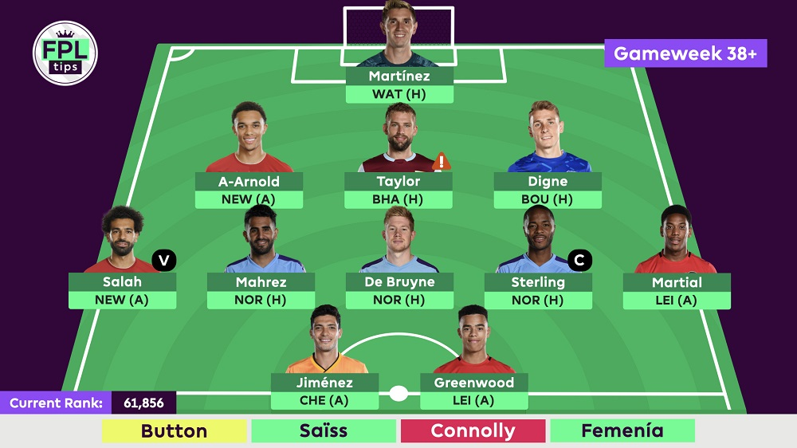
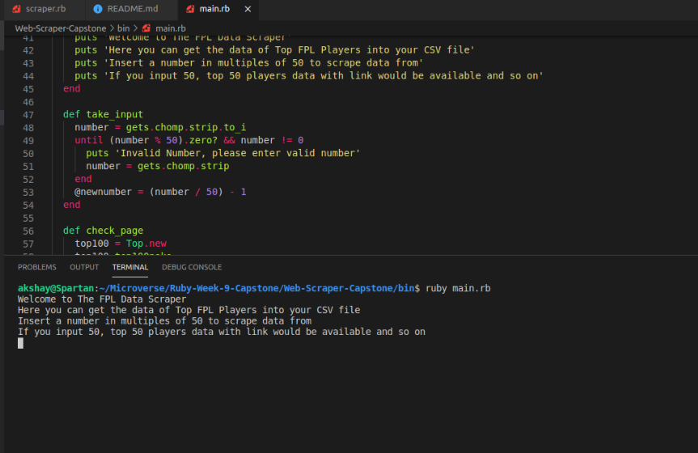
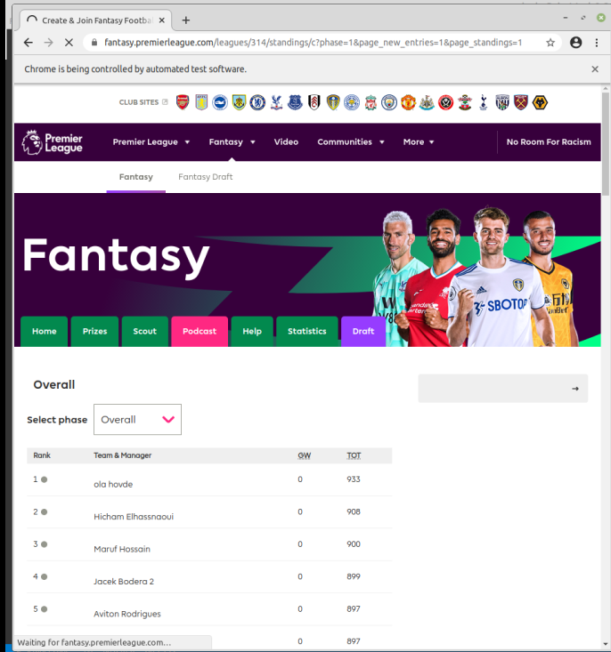
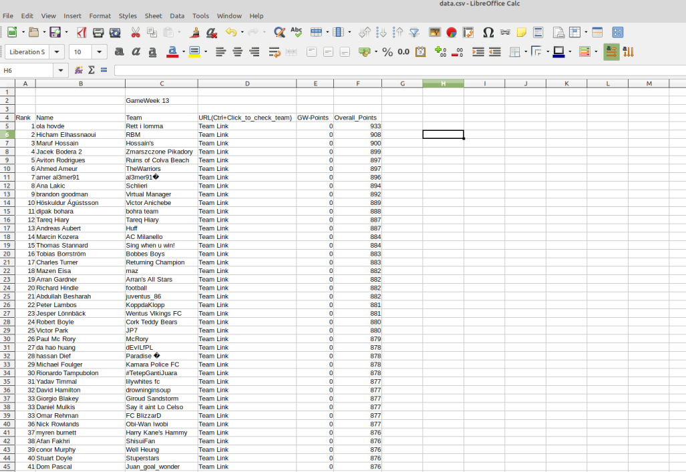
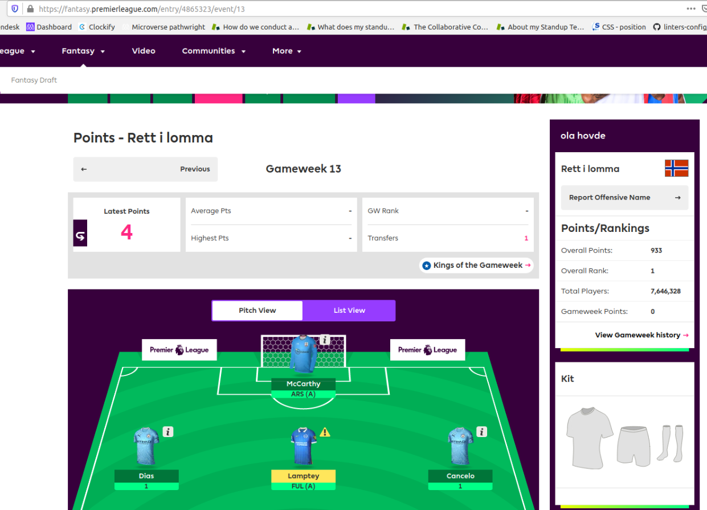

# 💎Ruby Capstone Project <br> ⚒ The FPL Scraper

A scraper is a tool that lets you collect and save data off documents that is visible on the screen.


The FPL Scraper allows the user to search for Top players on [Fantasy Premier League](https://fantasy.premierleague.com) web site.


 
<br>

Over 7.3 million players play the game & build their teams every week. With this scraper you can save the top team every week and compare the top players,
check and compare their teams!

The data is displayed in a CSV file which gets appended everytime the scraper is run in the bin folder.

I have build this scraper to have a set of top 50-100 players in the world for certain weeks and build a similar team/follow the player.

Built using OOP principles.

## Getting Started

To get started, you should first get this file in your local machine by downloading this project or typing.

```git
git clone https://github.com/akshay-narkar/Web-Scraper-Capstone.git
```

### Prerequisites

Before you start using the scraper, you need to be sure that you have Ruby installed on your computer, by typing.

```
ruby -v
```

and it should return something like.

####### ruby 2.7.##### (20##-##-## revision 6####) [########]

If it's not installed in your system, follow this [guide](https://www.ruby-lang.org/en/documentation/installation/) and it will help you to get it done.

## Running the Program

You need to open your terminal and go to the downloaded folder, then You need to run the next command to install the gems.

```
bundle install
```

Then you can run the next command that starts the program.

```
ruby bin/main.rb
```



When the program starts, It is going to ask you to input the Top X number of players whose data you need saved.

```
150
```

The scraper uses Selenium Webdriver API which uses Chrome to open the webpages to scrape



Once the scraper is done fetching, it puts all the data in data.csv



To visit any of the player profiles, Ctrl + Click on the URLs



By default, the target of Scraper right now is to check the Top players in the world overall but you can simply change the url to whichever league you need in the lib/scraper.rb file. Counter variable is added at the end for every link. Moreover this data could be used to plot charts and derive various stats.

```
@browser.goto "https://fantasy.premierleague.com/leagues/314/standings/c?phase=1&page_new_entries=1&page_standings=#{counter}"
```

## Test-driven development RSPEC

The code includes unit testing using RSpec. To start the test, run the next line in your terminal:

```
rspec spec/scraper_rspec.rb
```

## 📡 Technologies used :

- Ruby
- RSpec - _Ruby Test Driven Development framework_

## 🔧 Tools used :

- [VSCode](https://code.visualstudio.com/) - _As a code editor_
- [Nokogiri](https://nokogiri.org/) - _Ruby gem as a Main tool_
- [Rubocop](https://rubocop.org/) - _Ruby gem as a Ruby Linter_
- [Google DevTools](https://developers.google.com/) - _Debugging tool_

## Author:

👤 **Akshay Narkar**

- Github: [@akshay-narkar](https://github.com/akshay-narkar)
- Twitter: [@akidoit](https://twitter.com/akidoit)

## 🤝 Contributing

Contributions, issues and feature requests are welcome! Start by:

- Forking the project
- Cloning the project to your local machine
- `cd` into the project directory
- Run `git checkout -b your-branch-name`
- Make your contributions
- Push your branch up to your forked repository
- Open a Pull Request with a detailed description to the development branch of the original project for a review

## Show your support

Give a :star: if you like this project!

## 📝 License

This project is [MIT](https://opensource.org/licenses/MIT) licensed.

- You can add negative test cases.
